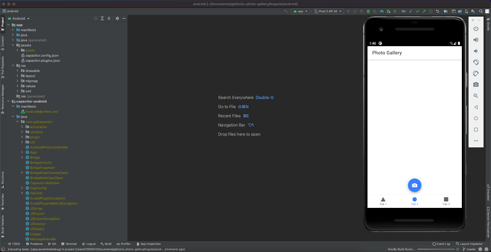

# ionic-photo-gallery



## Install node v14
```
https://nodejs.org/en/
```
## Homebrew install gradle
```
brew install gradle
```

## Install cocoapods
```
sudo gem install cocoapods
```
## Homebrew install android studio
```
brew install android studio
```

## Install Ionic Tooling

```
npm install -g @ionic/cli native-run cordova-res
```

## Create an App

```
ionic start ${project name} tabs --type=${angular|react|vue} --capacitor
```

## PWA Elements

```
npm install @ionic/pwa-elements
```

```
import { defineCustomElements } from '@ionic/pwa-elements/loader';

// Call the element loader after the platform has been bootstrapped
defineCustomElements(window);
```

## Install camera, storage, filesystem
```
cd project && npm install @capacitor/camera @capacitor/storage @capacitor/filesystem
```

## Run the App

```
ionic serve
```

## Create both the iOS and Android projects

```
ionic cap add ios
```

```
ionic cap add android
```

## iOS Deployment
```
ionic cap open ios
```

## Android Deployment Deployment
```
ionic cap open android
```


## Android Build
```
ionic capacitor build android --prod
```


## iOS Build
```
ionic capacitor build ios --prod
```
